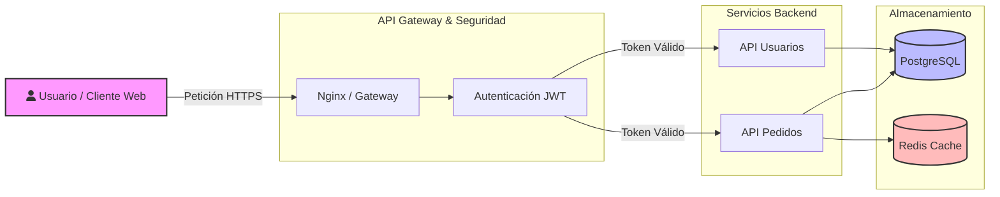

```mermaid
flowchart LR
    %% Definición de estilos y subgrafos (Capas)
    subgraph Capa_Seguridad [API Gateway & Seguridad]
        gateway[Nginx / Gateway]
        auth[Autenticación JWT]
    end

    subgraph Capa_Backend [Servicios Backend]
        api_pedidos[API Pedidos]
        api_usuarios[API Usuarios]
    end

    subgraph Capa_Datos [Almacenamiento]
        db_principal[(PostgreSQL)]
        db_cache[(Redis Cache)]
    end

    %% Componentes Externos
    usuario[fa:fa-user Usuario / Cliente Web]

    %% Flujos y Conexiones del Sistema
    usuario -- Petición HTTPS --> gateway
    gateway --> auth
    auth -- Token Válido --> api_pedidos
    auth -- Token Válido --> api_usuarios
    
    api_pedidos --> db_principal
    api_usuarios --> db_principal
    api_pedidos --> db_cache

    %% Estilos Visuales para GitHub
    style usuario fill:#f9f,stroke:#333,stroke-width:2px
    style db_principal fill:#bbf,stroke:#333,stroke-width:2px
    style db_cache fill:#fbb,stroke:#333,stroke-width:2px

```
